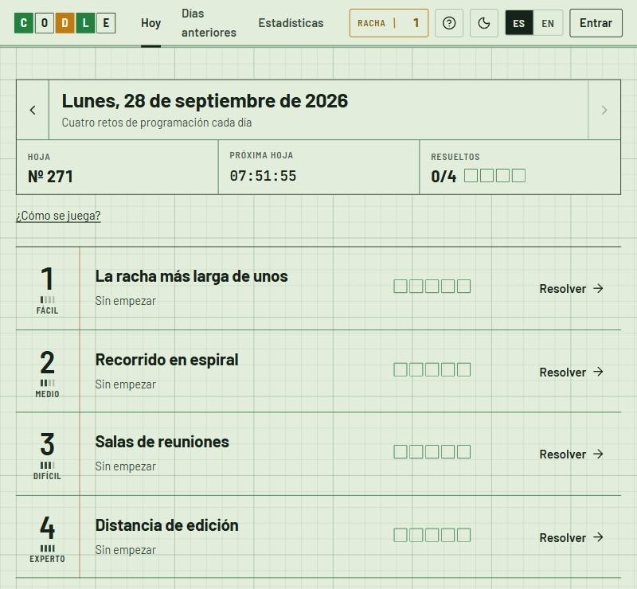
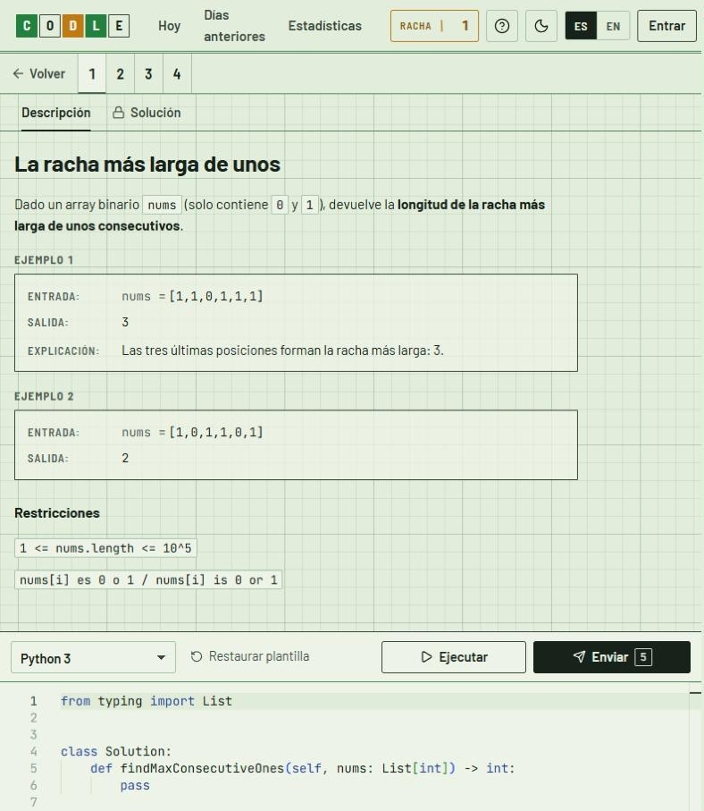

# Codle

Retos diarios de programación estilo Wordle. Cada día se publican **4 retos** (Fácil, Medio, Difícil y Experto) que se resuelven en un editor tipo LeetCode en **Python, JavaScript, TypeScript, Java, C++, C#, Go o Rust**. Hay **5 envíos** por reto y cada envío pinta una fila de casillas, una por test, como en Wordle. Al terminar un reto se desbloquean la solución oficial y su explicación.

**Web en vivo:** <https://codle-04p4.onrender.com>

<p>
  
  
</p>

## Funcionalidades

- Editor Monaco con plantilla generada para cada lenguaje.
- Ejecución de pruebas ilimitada con los ejemplos y envíos evaluados con tests ocultos.
- Tiempo de ejecución por test, y los errores de compilación no gastan intento.
- Cuentas opcionales: se puede jugar como invitado y el progreso pasa a la cuenta al registrarse.
- Rachas, días perfectos y estadísticas por nivel y por lenguaje.
- Archivo con los retos de días anteriores y filtros.
- Interfaz en español e inglés, con modo claro y oscuro.
- Panel de administración para revisar, editar, probar y publicar retos.
- Retos nuevos cada noche, generados por un agente de IA y validados contra una solución de referencia y una fuerza bruta.

## Stack

| Parte | Tecnología |
|---|---|
| Frontend | React 19, Vite, TypeScript, Monaco Editor, React Router |
| Backend | Node.js, Express, TypeScript |
| Base de datos | MongoDB (Mongoose) |
| Ejecución de código | [Wandbox](https://wandbox.org), Judge0 o un ejecutor local para desarrollo |
| Despliegue | Render + MongoDB Atlas |

## Cómo funciona la ejecución

```
código del usuario + driver generado  ──►  Wandbox / Judge0  ──►  stdout con marcadores  ──►  veredicto por test
             ▲                                   ▲
   plantilla a partir de la firma      tests codificados por stdin
```

- Cada reto define una **firma tipada** (`functionName`, parámetros y tipo de retorno). A partir de ella se generan la plantilla del editor y un *driver* para cada lenguaje (`server/src/harness/`).
- Tipos soportados: `int, long, double, bool, string`, sus arrays `[]`, y `int[][]` y `string[][]`.
- Los tests viajan por **stdin** como tokens simples, así se admiten entradas grandes (hasta 700 KB por test).
- Si los tests no caben en una sola petición (Wandbox admite 1 MB), se reparten en varias y se juntan los resultados.
- El driver vigila el límite de tiempo: si se agota, imprime `NONCE:i:TLE` y termina.
- Cada test imprime `NONCE:i:OK:<json>`. El nonce es aleatorio en cada ejecución, así que no se pueden falsificar resultados imprimiendo esas líneas.
- La comparación se hace en el servidor: exacta, con tolerancia `1e-6` en decimales, o sin orden (`unordered`, `unordered-deep`).
- De los tests ocultos nunca se muestra el contenido, solo el tipo de error.

## Generación de retos

Un agente programado prepara cada noche los retos de los próximos días:

1. Escribe un *spec* por día en `retos/specs/AAAA-MM-DD.py`, con 4 problemas: enunciado en español e inglés, tests, solución de referencia y fuerza bruta.
2. `tools/retos/build.py` calcula las salidas con la referencia, las contrasta con la fuerza bruta, valida tipos y tamaños y genera `retos/AAAA-MM-DD.json`.
3. El servidor importa los `.json` al arrancar y cada 5 minutos.

Los *specs* no se versionan para no publicar las soluciones antes de tiempo.

## Ejecutarlo en local

Requisitos: **Node 20+** y MongoDB (Docker, Atlas o instalado en local).

```bash
cp .env.example server/.env    # rellena MONGODB_URI, JWT_SECRET y EXECUTOR
npm install
npm run seed                   # carga retos de ejemplo
npm run dev                    # API en :4000 y web en http://localhost:5173
```

- `npm run dev:local` arranca además un MongoDB embebido, sin Docker.
- En Windows, `iniciar.bat` hace todo lo anterior con doble clic.
- Con `EXECUTOR=wandbox` (por defecto) no hace falta ninguna clave. `EXECUTOR=local` ejecuta el código en tu máquina sin aislamiento y solo sirve para desarrollo.

### Otros comandos

```bash
npm test                               # tests del motor en los 8 lenguajes
npm run build && npm start -w server   # producción: Express sirve también el frontend
npm run make-admin -w server -- <email|usuario>   # da permisos de administrador
```

## Estructura

```
client/                React + Vite
  src/pages/           Hoy, días anteriores, reto (editor), estadísticas y administración
  src/components/      Layout y casillas estilo Wordle
  src/lib/             API, i18n (es/en), Monaco y formato
server/                Express + MongoDB
  src/harness/         tipos, plantillas, drivers por lenguaje, codificación y comparación
  src/executor/        Wandbox, Judge0 y ejecutor local
  src/services/        lógica de días, progreso, envíos, importación y administración
  src/seed/            retos de ejemplo
  src/tests/           tests end-to-end del harness
tools/retos/           construcción y validación de retos
```

## API

| Método | Ruta | Descripción |
|---|---|---|
| GET | `/api/meta` | fecha de hoy, tiempo hasta el siguiente día y número de intentos |
| GET | `/api/days/:date` | retos de un día (`today` o `YYYY-MM-DD`) con el progreso del jugador |
| GET | `/api/calendar` | días con retos y cuántos ha resuelto el jugador |
| GET | `/api/problems/:id` | enunciado, ejemplos, plantillas y progreso |
| POST | `/api/problems/:id/run` | ejecuta con los ejemplos (ilimitado, con límite de frecuencia) |
| POST | `/api/problems/:id/submit` | envío evaluado con ejemplos y tests ocultos (máx. 5) |
| GET | `/api/auth/me` | usuario actual (o `null` si es invitado) y racha |
| POST | `/api/auth/register` | crea una cuenta y le pasa el progreso del invitado |
| POST | `/api/auth/login` | inicia sesión con email o usuario |
| POST | `/api/auth/logout` | cierra sesión |
| GET | `/api/stats` | racha, distribución de envíos y estadísticas por nivel y lenguaje |

Las contraseñas se guardan con scrypt. La **racha** cuenta los días seguidos en los que se resuelve al menos un reto el mismo día de su publicación.
